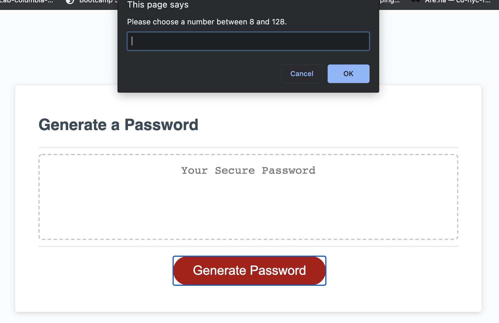
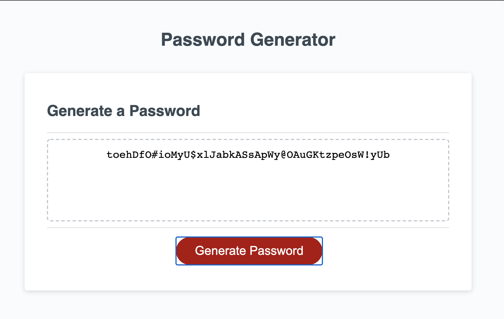

# JavaScript: Password Generator 

## Description 
* I created a password-generating application using JavaScript. 
* The site provides the user a random password after satisfying a series of prompts. First, the user must decide on the length of the password from 8 to 128. Then, the user must select at least one type of characters that will go into the password, e.g. numbers, special characters. 
* Once all the required information is acquired from the user, a random password is displayed in a text area on the body of the website. 

## Links

## Screenshots

